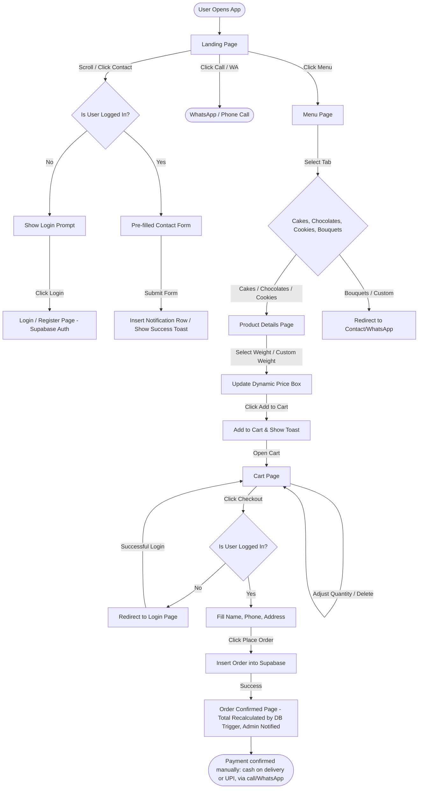
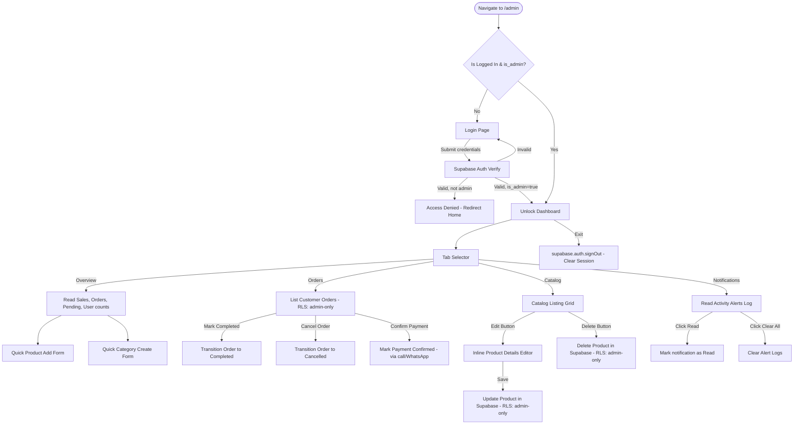
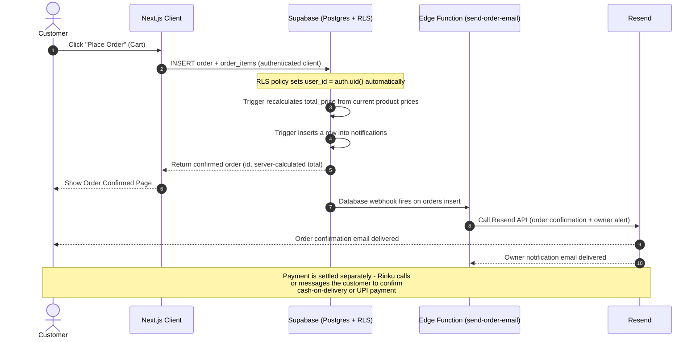

# Application User Flow Document - Sweet Surprise

This document details the screen navigations, role boundaries, and data
interaction sequences for customers and the admin owner (Rinku Adani),
built on Next.js + Supabase (no custom backend server, no payment gateway).

## 1. Customer User Flow

The customer flow covers landing page browsing, dynamic product actions, cart additions, authentication guards, and order placement.

---

## 2. Owner / Admin Dashboard Workflow

Access to the Admin Panel is gated by Supabase Auth plus an `is_admin` flag
on the user's `profiles` row, enforced both in middleware and by Row Level
Security at the database. Once unlocked, Rinku Adani accesses a dashboard
featuring multi-tab control panels.

---

## 3. Detailed Sequence Diagrams

### 3.1. Checkout Order Placement (Supabase-driven, no payment gateway)

