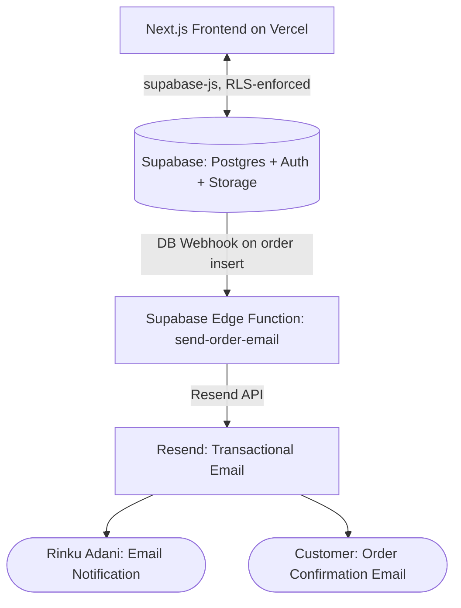

# Technical Requirements Document (TRD) - Sweet Surprise

## 1. System Architecture
The application uses a managed-services architecture: a Next.js frontend
talking directly to Supabase, with no custom backend server to deploy,
patch, or scale.

---

## 2. Technical Stack
- **Frontend Framework**: Next.js 15 (App Router)
- **Styling**: Tailwind CSS
- **Components**: Radix UI (Shadcn templates)
- **State & Data**: React Context + the `supabase-js` client library — no custom REST framework to maintain
- **Forms & Validation**: React Hook Form + Zod schema validation
- **Database**: Supabase (managed Postgres)
- **Authentication**: Supabase Auth (built-in email/password, session cookies via `@supabase/ssr`)
- **Authorization**: Postgres Row Level Security (RLS) policies — enforced at the database layer, not in custom backend code
- **File Storage**: Supabase Storage (product images)
- **Background Jobs**: Supabase Edge Functions (Deno runtime), triggered by database webhooks
- **Email**: Resend
- **Hosting**: Vercel (frontend), Supabase (database, auth, storage, functions)
- **Version Control & CI/CD**: GitHub, auto-deployed to Vercel on push to `main`

---

## 3. Security & Authentication
- **Password Protection**: Handled entirely by Supabase Auth internally. The application never stores, sees, or logs a raw or hashed password.
- **Session Tokens**: Supabase issues and refreshes JWT-based session tokens automatically. Next.js `middleware.ts` refreshes the session on every request and blocks unauthenticated access to protected routes.
- **Authorization**: Enforced via Row Level Security policies rather than custom backend route guards. Every table query — whether from a page, a component, or a malicious actor with dev tools open — passes through the same database-level check. A frontend bug cannot expose data the policy disallows, because the database itself rejects the unauthorized query.
- **Admin Role**: A single `is_admin` boolean on `profiles`, set manually in the Supabase dashboard. There is no client-reachable way to grant admin access.
- **Input Sanitization**: Zod validates all form input on the frontend; Postgres column constraints and RLS policies provide a second, server-side enforcement layer that doesn't depend on the frontend behaving correctly.
- **Price Integrity**: Order totals are recalculated by a Postgres trigger from authoritative product prices on every insert — a client cannot submit a tampered total.
- **Secrets**: The Supabase service role key and the Resend API key never appear in any file shipped to the browser; the service role key is used only in `lib/supabase/server.ts`, and the Resend key only inside the `send-order-email` Edge Function.

---

## 4. Data Access Contract
There's no custom REST API to document here — the frontend talks to
Supabase directly using `supabase-js`, and what a given user can do is
governed entirely by the RLS policies in `backend_schema.md`. The table
below documents the logical operations and which mechanism handles each.

### 4.1. Authentication
- **Sign up**: `supabase.auth.signUp()` — profile row created automatically via trigger.
- **Log in**: `supabase.auth.signInWithPassword()`.
- **Get current user**: `supabase.auth.getUser()` / `getSession()`.
- **Log out**: `supabase.auth.signOut()`.

### 4.2. Categories
- **Read all**: `supabase.from('categories').select()` — public SELECT policy.
- **Create / rename / delete**: `.insert()` / `.update()` / `.delete()` — admin-only policy.

### 4.3. Products
- **Read one / all**: `supabase.from('products').select()` — public SELECT policy.
- **Create / update / delete**: admin-only policy, includes image upload to Supabase Storage.

### 4.4. Orders
- **Place order**: `supabase.from('orders').insert()` + `order_items` insert — RLS sets `user_id = auth.uid()`; trigger recalculates `total_price`.
- **List all orders (admin)**: `supabase.from('orders').select()` — admin-only policy.
- **Update status / payment_confirmed**: `.update()` — admin-only policy.

### 4.5. Contact & Notifications
- **Submit contact form**: handled by a thin Next.js route handler (`app/api/contact/route.ts`) that validates with Zod and writes to `notifications` — kept as a small server route since contact submission shouldn't strictly require a logged-in session.
- **List / mark-read / clear notifications**: `supabase.from('notifications')` calls — admin-only policy.

---

## 5. Performance, SEO & Accessibility
- **Performance**:
  - Image optimization via Next.js `<Image>` component, sourced from Supabase Storage.
  - Order totals recalculated server-side by a Postgres trigger, preventing cart total manipulation — no custom backend logic required to enforce this.
- **SEO Best Practices**:
  - Semantic tags (`<h1>`–`<h6>`, `<section>`, `<article>`).
  - Unique meta descriptions for dynamic product routes.
  - Page titles, e.g. `<title>Sweet Surprise - Custom Artisan Cakes & Chocolates</title>`.
- **Accessibility**:
  - Keyboard navigation for Radix Accordion elements.
  - Contrast ratios meeting WCAG AA standards.
  - Clear aria labels on icons and buttons.
